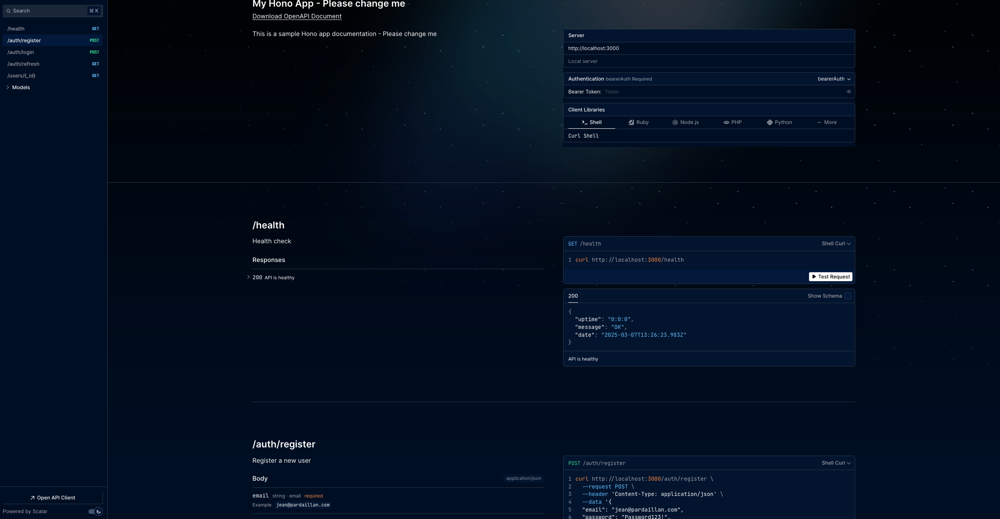

# Hono Minimal Kit

## Table of Contents

- [Project Overview & Reasoning](#project-overview--reasoning)
- [Features](#features)
- [Resources & External Documentation](#resources--external-documentation)
- [Prerequisites](#prerequisites)
- [Installation](#installation)
- [Running the Project](#running-the-project)
- [Scripts](#scripts)
- [Project Structure](#project-structure)
- [Environment Variables](#environment-variables)
- [API Documentation](#api-documentation)
- [Docker & CI/CD](#docker--cicd)
- [Developer Experience & Where to write code - Please read](#developer-experience--how-to-write-code)

## Project Overview & Reasoning

This boilerplate provides a starting point for building web applications with Node and Hono. It includes configurations
for TypeScript, ESLint, Prettier, and Mikro-ORM for database management.
This is highly opinionated.

The boilerplate was initially created for a GitLab project, so it includes a GitLab CI/CD configuration file and CI/CD is for that.
I am too lazy to migrate it to GitHub Actions, but you can do it easily if you want to use GitHub Actions.

It doesn't encourage you to overuse TypeScript nor OOP principles, but it does encourage you to use it where it makes
sense.
Most of the time you'll find that this is mostly used for database entities.
The code should be written inside the controller directly, and not in a service class, in a different file.
I am not a fan of too many abstractions, and I believe that the code should be as simple as possible, and easy to read.
You will see that the code is written in a procedural & functional way, and not in an OOP way. But don't overuse
functional programming
principles either. Use them where it makes sense, and where it makes the code easier to read and understand.

I am personally a big fan of procedural & imperative programming, and I believe that it is the best way to write code as
it forces you
to understand the code you are writing, and not just write it because it works. Don't be afraid of long functions.
If you want to read more and learn more about this YouTube Brian Will and his 2 popular videos about OOP.

I went with Hono because it is a small, [fast](https://hono.dev/docs/concepts/benchmarks), portable and simple web
framework for JavaScript ecosystem. You can switch from Node to Deno, Bun, Lambda, or Cloudflare workers easily. It is
very simple to use, and it is very fast. Better results than Express.js and other popular frameworks.

I am not a fan of ORMs, but I have included Mikro-ORM in this boilerplate. I have had problems with performance and for
complex queries they become hard to read. I went with it because it is built on top of Knex.js and I had good
experiences with it.
If you don't like it, you can use the [query builder from Mikro-ORM](https://mikro-orm.io/docs/query-builder/).

I might be right, I might be wrong but that's how I felt when I wrote this boilerplate. Heavily inspired
by [FastAPI](https://fastapi.tiangolo.com/tutorial/bigger-applications/) and my previous boilerplate written for that
framework.

I hope you will find this boilerplate useful and that you will learn something from it. I am open to suggestions and
improvements.

## Features

- **[Node](https://nodejs.org)**: A secure runtime for JavaScript and TypeScript.
- **[Hono](https://hono.dev/)**: A small, fast, and simple web framework for Node | Deno | Bun | Lambda | Cloudflare
  workers.
- **[TypeScript](https://www.typescriptlang.org/)**: Strongly typed programming language that builds on JavaScript.
- **[Mikro-ORM](https://mikro-orm.io/)**: TypeScript ORM for Node.js based on Data Mapper, Unit of Work, and Identity
  Map patterns.
- **[Zod](https://zod.dev/)**: TypeScript-first schema declaration and validation library.
- **[OpenAPI](https://www.openapis.org/what-is-openapi)**: API documentation and validation.
- **[Scalar](https://scalar.com/)**: The modern open-source developer experience platform for your APIs.
- **[Husky](https://typicode.github.io/husky/)**: Git hooks made easy.

## Resources & External Documentation

- **[Hono Documentation](https://hono.dev/docs/)**: Learn more about Hono.
- **[Micro-ORM Documentation](https://mikro-orm.io/docs/)**: Learn more about Mikro-ORM.
- **[Hono Zod OpenAPI](https://github.com/rhinobase/hono-openapi-zod)**: Generate OpenAPI schemas from Zod schemas for
  Hono.

## Prerequisites

Before you begin, ensure you have met the following requirements:

- **Node:22.14.0**: Install Node from [nodejs.org](https://nodejs.org).
- **pnpm:10.5.2**: Install pnpm from [pnpm.io](https://pnpm.io/installation).
- **Docker:20.10.23**: Install Docker from [docker.com](https://www.docker.com/get-started).
  Those are the versions I used to develop this boilerplate. You can use other versions, but I can't guarantee that
  everything will work as expected.

## Installation

1. Clone the repository:

   ```sh
   git clone https://github.com/Tech-Dex/hono-minmial-kit.git
   cd hono-minmial-kit
   ```

2. Change the git remote URL:

   ```sh
   git remote set-url origin <your-repository-url>
   ```

3. Install dependencies:

   ```sh
   pnpm install
   ```

## Running the Project

You should have the environment variables set in the `.env` file. [Read more about environment variables](#environment-variables).

To start the development server, run:

```sh
pnpm dev
```

To build the project, this will create the `dist` directory, run:

```sh
pnpm build
```

To start the production server, you must have the `dist` folder directory by the build command. Run:

```sh
pnpm production
```

You can also run it with Docker and Docker Compose, I recommend you to use it for development.

1. Run the docker compose stack:

```sh
pnpm docker:dev:up
```

2. Stop the docker compose stack:

```sh
pnpm docker:dev:down
```

3. Check the logs:

```sh
pnpm docker:dev:logs
```

or

```sh
pnpm docker:dev:logs -f <service-name>
```

## Scripts

Here are the available scripts for this project:

- `dev`: Start the development server with hot-reloading.
- `start`: Start the server with ts-node. (Useful for debugging)
- `format`: Format the code using Prettier.
- `lint`: Lint the code using ESLint.
- `lint:fix`: Lint and fix the code using ESLint.
- `check`: Type-check the code using TypeScript.
- `build`: Build the project. A `dist` folder will be created.
- `production`: Start the production server.
- `prepare:commit`: Run checks and format code before committing. Run it always before you want to git add and commit.
- `db:mgrt:initial`: Create the initial database migration.
- `db:mgrt:create`: Create a new database migration.
- `db:mgrt:up`: Apply all pending migrations.
- `db:mgrt:down`: Revert the last migration.
- `db:mgrt:list`: List all migrations.
- `db:mgrt:check`: Check the status of migrations.
- `db:mgrt:pending`: List all pending migrations.
- `db:mgrt:fresh`: Recreate the database and apply all migrations.
- `db:seed:create`: Create a new database seed. (Most likely will not be needed, you can insert everything in the
  initial seed)
- `db:seed:run`: Run all seeds. (Will apply the seed over the current data in the database)
- `db:seed:fresh`: Recreate the database, apply all migrations, and run all seeds.
- `gen:secret`: Generate a new JWT secret.
- `docker:dev:up`: Start the development stack with Docker Compose.
- `docker:dev:down`: Stop the development stack with Docker Compose.
- `docker:dev:logs`: Show the logs of the development stack with Docker Compose.

## Project Structure

```plaintext
.
├── .husky/                     # Git hooks
├── dist/                       # Compiled source code - not included in the repository
├── .env                        # Environment configuration file
├── logs/                       # Log files generated by the application - not included in the repository
│   └── traffic/                # Traffic logs generated by the application - not included in the repository
├── src/                        # Source code
│   ├── core/                   # Core modules and utilities (You can add/edit more configurations here, but most likely you will not need to)
│       ├── config-factory.ts   # Configuration factory for Hono
│       ├── logger.ts           # Logger class
│       └── security.ts         # Security functions
│   ├── entities/               # Database entities
│   ├── lib/                    # Libraries that are not specific to the application. For example: enums, types, errors, a standalone mail service, etc.
│   ├── routers/                # API route handlers
│       ├── router.ts           # Main router. Add new routes here. Auth and users routes are already added.
│       ├── auth.router.ts      # Auth routes
│       └── users.router.ts     # Users routes
│   ├── schemas/                # Request &  Response validation schemas
│       ├── errors.ts           # Generic zod schemas for error responses. (You can add more here based on your needs)
│       ├── requests.ts         # Request validation schemas
│       └── responses.ts        # Response validation schemas
│   ├── seeders/                # Database seeders
│       └── DatabaseSeeder.ts   # Initial database seeder. You can add your seed data here, not really necessary to create new seeders.
│   ├── utils/                  # Utility functions
│       └── middlewares.ts      # Middleware functions. You will most likely need to add more middlewares here. You have an example for a middleware in here.
│   ├── index.ts                # Entry point of the application. (Most likely you will not need to edit this file, it can be changed to use Bun/Deno instead of Node)
│   └── mikro-rom.config.ts     # Mikro-ORM configuration. (You will most likely not need to edit this file)
├── .eslintrc.json              # ESLint configuration
├── .prettierrc                 # Prettier configuration
├── package.json                # Project metadata and scripts
├── pnpm-lock.yaml              # Lockfile for dependencies
└── tsconfig.json               # TypeScript configuration
```

## Environment Variables

The project uses environment variables for configuration. You can find the environment variables in the `envs`
directory.
You can create a `.env` file in that directory and fill it.

| Key                | Value                         | Description                                                                            |
| ------------------ | ----------------------------- | -------------------------------------------------------------------------------------- |
| NODE_ENV           | development                   | The environment in which the application runs.                                         |
| MIKRO_ORM_PORT     | 3000                          | The port on which the server listens.                                                  |
| MIKRO_ORM_HOST     | localhost                     | The database host address. localhost will work with you docker database.               |
| MIKRO_ORM_USER     | postgres                      | The database user.                                                                     |
| MIKRO_ORM_PASSWORD | pass                          | The password for the database user.                                                    |
| MIKRO_ORM_PORT     | 5432                          | The port on which the database listens.                                                |
| MIKRO_ORM_DB_NAME  | default-db                    | The name of the database.                                                              |
| JWT_SECRET         | secret                        | The secret key used for signing JWT tokens. You can generate it with `pnpm gen:secret` |
| JWT_ALG            | HS256                         | The algorithm used for signing JWT tokens.                                             |
| DOMAIN             | mywebsite.com                 | The domain name of the application. Used for CORS.                                     |
| MAILTRAP_HOST      | sandbox.smtp.mailtrap.io      | The host for the Mailtrap SMTP service.                                                |
| MAILTRAP_PORT      | 2525                          | The port for the Mailtrap SMTP service.                                                |
| MAILTRAP_USER      | 1b1b1b1b1b1b1b                | The username for the Mailtrap SMTP service.                                            |
| MAILTRAP_PASS      | 2b2b2b2b2b2b2b                | The password for the Mailtrap SMTP service.                                            |
| TARGET_MAIL_SERVICE| mailtrap                      | The target mail service to be used.                                                    |

## API Documentation

The project uses OpenAPI for API documentation. You can find the API documentation at `/docs` endpoint when the server
is running. The documentation is generated using Scalar. The health check endpoint is available at `/health`.


### Example Routes

- **POST /auth/login**: Login a user.
- **POST /auth/register**: Register a new user.
- **GET /auth/refresh**: Refresh the JWT token. (requires JWT authentication).
- **GET /users/:\_id**: Get user by ID (requires JWT authentication).

## Docker & CI/CD

The project includes a Dockerfile and a docker-compose.yml file for running the application in a Docker container. There
is also a GitLab CI/CD configuration file for packaging the application in an image and save it in the GitLab registry.

In GitLab CI/CD, you can use the following variables, you have to set the $ENV_FILE in variables:
-> Settings -> CI/CD -> Variables -> Add Variable -> Key: ENV_FILE, Type: file -> Value: what you have in .env file

The .gitlab-ci.yml file is configured to run the following stages:

- copy the .env file to the root directory ( as the .env is not tracked by git, we add it to the root directory only for the CI/CD)
- run the docker build command

You can add a new stage for deploying the application to a server. There you can use sth like AWS ECS or SSH into
a server, git pull the code, and run the docker compose command. For the second option you'll be required to add a new
variables in the GitLab CI/CD settings for the SSH key ( SSH_PRIVATE_KEY ) and the host ( SSH_HOST ). YOu have an example
in the .gitlab-ci.yml file.

There are files for development: dev.docker-compose.yml and dev.Dockerfile. You can use them to run the application in
development mode with Docker. You can use the following commands:

- `pnpm docker:dev:up`: Start the development stack with Docker Compose.
- `pnpm docker:dev:down`: Stop the development stack with Docker Compose.
- `pnpm docker:dev:logs`: Show the logs of the development stack with Docker Compose.
- `pnpm docker:dev:logs -f <service-name>`: Show the logs of a specific service with Docker Compose.

Most likely you will not need to change anything in those. The Dockerfiles uses the volume to mount the source code
from your local machine to the container. This way you can make changes to the code and see the changes in real-time.

## Developer Experience & Where to write Code

- Most of the time you'll find yourself working only inside the following
  directories: `src/routers`, `src/entities`, `src/schemas`, `src/utils`. Sometimes you might need to work
  inside `src/lib` and `src/seeders` ( if you don't want to create testing data manually ).
- You should write the code inside the controller directly, and not in a service class or in a different file. If you
  need to reuse some code, you can create a utility function inside `src/utils` and import it in the controller. Pass
  the Context object or only what you need from context to the utility function.
- Use plural names for the routes. For example, use `/users` instead of `/user`.
- Use plural names for the entities. For example, use `Users` instead of `User`. The database table names should be
  plural as well.
  - `Users` entity will be stored in the `users` table.
  - One-to-many relationships should be named singular_plurals. Example: `user_tickets` table.
  - Many-to-many relationships should be named plurals_plurals. Example: `users_roles` table. If you find a better
    name like `relationships` instead of `users_friends`, you can use that.
- If you want to start with a different database schema, just delete everything from `src/migrations`, define your new
  entities in `src/entities`, and run `pnpm db:mgrt:initial`. This will create the initial migration for your new
  schema.
- Use snake_case for the database column names. For example, use `users_roles` instead of `usersRoles`.
- Use camelCase for the properties of the entities & request and response schemas For example, use `firstName` instead
  of `first_name`.
- Use PascalCase for the class names. For example, use `Users` instead of `users` or `UsersRoles` instead
  of `usersRoles`.
- TypeScript it is not mandatory to use, it becomes tedious to use it in some cases, and it is not always necessary.
  Write it for things that will be reused, in a controller where you just fetch data from database, you can skip it. In
  the end the code will be compiled to plain JavaScript. TypeScript is it here you help you develop safer code and catch
  errors before they happen. If you are using a code editor (VSCode) install plugins that will tell you the variable
  type or make yourself a favor and use an IDE like [WebStorm](https://www.jetbrains.com/webstorm/) that way you will
  know types even if not declared specifically.
- Use [Convco](https://convco.github.io/). This is a non-negotiable. It forces you to write decent commits.
- Use [Docker](https://www.docker.com/) for development. Start a database container and connect your local code to it.
  Later you'll test if it works for deployment with docker-compose.yml and the docker compose command.
- Don't run the project with node-ts. DON'T DO IT. It is slow, and it is not recommended for production. Build the `dist`
  directory and run the project from there. Use `pnpm dev` for development and `pnpm production` for production.

## Contact

For any questions or inquiries, please contact:

- **[FastAPI Infra Kit](https://github.com/Tech-Dex/fastapi-infra-kit)**: If you want to use
  Python for specific features, you can use this boilerplate.
